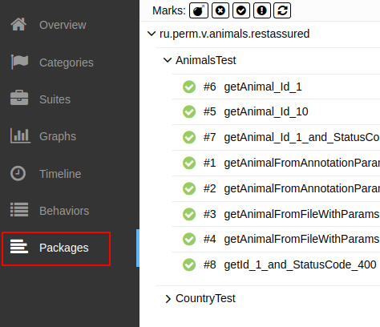
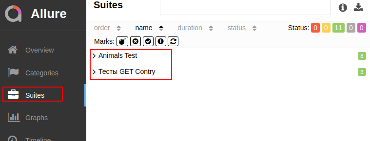
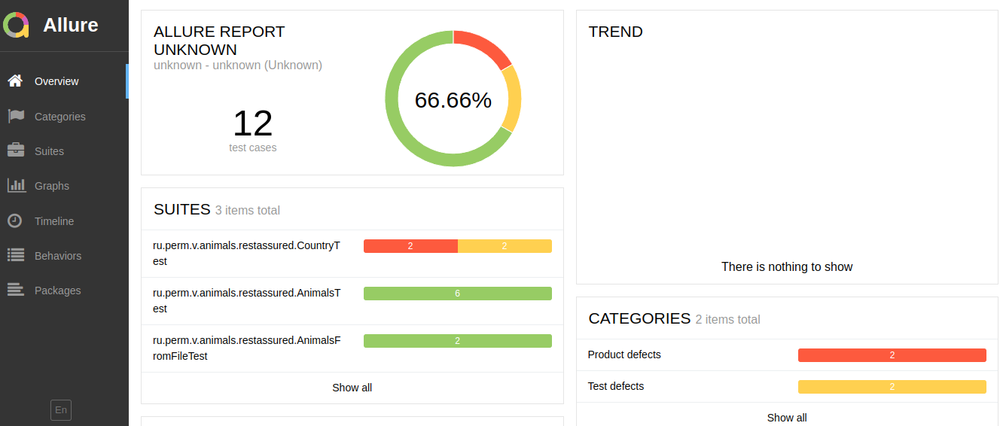
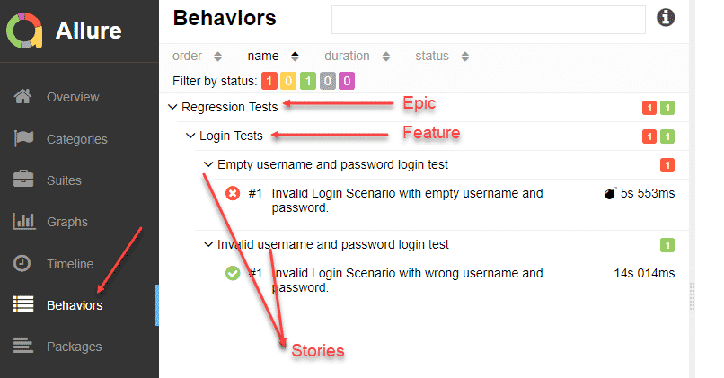

### Behave тестирование RestAssured

Для проведения тестов использован RestAssured<br/>
 [https://github.com/rest-assured/rest-assured](https://github.com/rest-assured/rest-assured/wiki/GettingStarted).

Для просмотра отчетов Allure [https://docs.qameta.io/allure/](https://docs.qameta.io/allure/)

Скрипты выполнять из папки проекта с тестами Rest Assured. 
Перед запуском тестов нужно запустить сам проект:
[https://github.com/cherepakhin/shop_kotlin](https://github.com/cherepakhin/shop_kotlin)

Константы (адрес сервиса, REST пути и т.п.) заданы в [src/test/kotlin/ru/perm/v/shop_kotlin/restassured/CONST.kt](https://github.com/cherepakhin/shop_kotlin/src/test/kotlin/ru/perm/v/shop_kotlin/restassured/CONST.kt)

````kotlin
class CONSTS {
    companion object { //TODO
        val HOST = "http://127.0.0.1:8780/api"
        val ECHO_PATH = HOST + "/echo/"
        val GROUP_PATH = HOST + "/group_product/"
        val PRODUCT_PATH = HOST + "/product/"
    }
}

````
```shell
# Проведение теста
shop_kotlin-restassured-test$ mvn clean test
# Просмотр отчета в браузере
shop_kotlin_restassured_test$ ./allure serve target/surefire-reports/
```


### Памятка по группировке тестов allure


Пример:

```java
@Tag("ahop_kotlin")
@Epic("REST API ")
@DisplayName("Display name test") 
@Story("Story requests test")
@Feature("Verify CRUD Operations")
public class RestTest {
 
}

```

По пакетам:



По строгости (критичности) - аннотация @Severity(SeverityLevel.NORMAL). Работа аннотаций @Epic, @Suite:



Отчет с ошибками:



### Шпаргалка по вложенности



### Закладки

https://docs.qameta.io/allure/
https://allure-framework.github.io/allure-demo/5/#suites/a2891ce60e520f56ae25e6caf68ea773/448aea45096280d4/

~/prog/java/allure-examples/allure-junit5

````shell
shop_kotlin-restassured-test$ cd ~/<catalog project>
shop_kotlin-restassured-test$ mvn clean test
shop_kotlin-restassured-test$ allure serve allure-results/
````